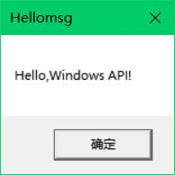
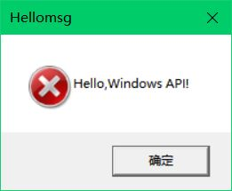

# 学习Windows API--从一个HelloWorld程序开始

```c
#include<Windows.h>
int WINAPI WinMain(HINSTANCE hInstance,HINSTANCE hPrevInstance,PSTR szCmdLine,int iCmdShow)
{
    MessageBox(NULL,TEXT("Hello,Windows API!),TEXT("Hellomsg"),0);
    return 0;
}
```

**Windows.h**包含了若干Windows头文件.下面是几个最重要也是最基本的头文件:

> *windef.h* 基本数据类型定义

> *winnt.h* 支持Unicode的类型定义

> *winbase.h* 内核函数

> *winuser.h* 用户界面函数

> *wingdi.h* 图形设备接口函数

Windows程序的入口是**WinMain**,WinMain总是这样出现:`int WINAPI WinMain(HINSTANCE hInstance,HINSTANCE hPrevInstance,PSTR szCmdLine,int iCmdShow)`.

Windows API采用"匈牙利标记法",变量名前使用短前缀表示数据类型.前缀i--int,sz--"以0结尾的字符串"(String Terminated with a Zero)

在windef.h中:

```c
#define WINAPI __stdcall
```

Windows API的函数调用规则是stdcall.函数的参数传递一般通过堆栈进行.stdcall调用规则用x86汇编语言表示如下:

```shell
push 最右侧参数
push 右2
...
push 最左侧参数
call 子程序
...
子程序:
...
pop ...
pop ...
pop ...
...
```

与此类似,C函数的调用规则是cdecl,即:

```shell
push 最右侧参数
push 右2
...
push 最左侧参数
call 子程序
pop ...
pop ...
pop ...
...
子程序:
...
```

还有一些其他的调用方式,如pascal.

如果想要在C/C++中调用Windows API函数,应将函数的调用方式声明为`__stdcall`.所以WinMain才长成这个样子:`int WINAPI WinMain(参数...)`.

下面来看WinMain的函数原型(在winbase.h中):

```c
int WINAPI WinMain(HINSTANCE hInstance,HINSTANCE hPrevInstance,LPSTR lpCmdLine,int nShowCmd);
```

原型的参数与程序中的参数稍有不同.第三个参数在定义中类型为LPSTR,程序中却变成了PSTR.前缀LP代表长指针,是16位Windows的历史遗留.

第一个参数叫作"实例句柄",句柄可以理解为一个指针,标识了这个程序.

第二个参数在32位Windows中已不再使用,通常总是NULL.

第三个参数:用来运行程序的命令行.

第四个参数:指明程序最初如何显示(最大化,正常显示,最小化).

MessageBox函数:

用来显示短信息.

第一个参数:一个窗口句柄.第二个参数:信息框中的文本字符串.第三个参数:标题栏上的文本字符串.第四个参数:MB_打头的一些常量的组合.

TEXT是一个宏,使用TEXT宏在把程序转换为Unicode时会方便很多.

在winuser.h中:

```c
#define MB_OK                       0x00000000L
#define MB_OKCANCEL                 0x00000001L
#define MB_ABORTRETRYIGNORE         0x00000002L
#define MB_YESNOCANCEL              0x00000003L
#define MB_YESNO                    0x00000004L
#define MB_RETRYCANCEL              0x00000005L
#if(WINVER >= 0x0500)
#define MB_CANCELTRYCONTINUE        0x00000006L
#endif /* WINVER >= 0x0500 */


#define MB_ICONHAND                 0x00000010L
#define MB_ICONQUESTION             0x00000020L
#define MB_ICONEXCLAMATION          0x00000030L
#define MB_ICONASTERISK             0x00000040L

#if(WINVER >= 0x0400)
#define MB_USERICON                 0x00000080L
#define MB_ICONWARNING              MB_ICONEXCLAMATION
#define MB_ICONERROR                MB_ICONHAND
#endif /* WINVER >= 0x0400 */

#define MB_ICONINFORMATION          MB_ICONASTERISK
#define MB_ICONSTOP                 MB_ICONHAND

#define MB_DEFBUTTON1               0x00000000L
#define MB_DEFBUTTON2               0x00000100L
#define MB_DEFBUTTON3               0x00000200L
#if(WINVER >= 0x0400)
#define MB_DEFBUTTON4               0x00000300L
#endif /* WINVER >= 0x0400 */

#define MB_APPLMODAL                0x00000000L
#define MB_SYSTEMMODAL              0x00001000L
#define MB_TASKMODAL                0x00002000L
#if(WINVER >= 0x0400)
#define MB_HELP                     0x00004000L // Help Button
#endif /* WINVER >= 0x0400 */

#define MB_NOFOCUS                  0x00008000L
#define MB_SETFOREGROUND            0x00010000L
#define MB_DEFAULT_DESKTOP_ONLY     0x00020000L

#if(WINVER >= 0x0400)
#define MB_TOPMOST                  0x00040000L
#define MB_RIGHT                    0x00080000L
#define MB_RTLREADING               0x00100000L

#endif /* WINVER >= 0x0400 */

#ifdef _WIN32_WINNT
#if (_WIN32_WINNT >= 0x0400)
#define MB_SERVICE_NOTIFICATION          0x00200000L
#else
#define MB_SERVICE_NOTIFICATION          0x00040000L
#endif
#define MB_SERVICE_NOTIFICATION_NT3X     0x00040000L
#endif

#define MB_TYPEMASK                 0x0000000FL
#define MB_ICONMASK                 0x000000F0L
#define MB_DEFMASK                  0x00000F00L
#define MB_MODEMASK                 0x00003000L
#define MB_MISCMASK                 0x0000C000L
```

MessageBox的第四个参数传入0(MB_OK):



按下"确定"返回值为IDOK.返回值还可能是ISYES,ISNO,IDCANCEL,IDABORT,IDRETRY,IDIGNORE.

MessageBox的第四个参数传入MB_ICONHAND:



MessageBox的第四个参数传入MB_OKCANCEL|MB_ICONHAND:

