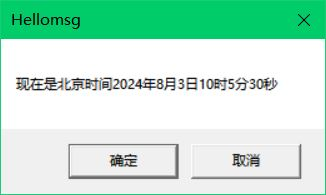
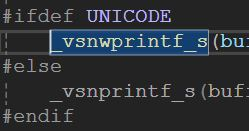
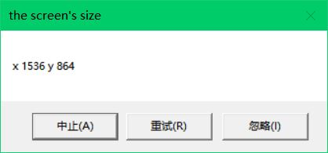

# 字符串

在C语言中,可以这样定义一个ASCII字符串:

```c
char* str="Hello,World!";
char str[]="Hello,World!";
char str[13]={'H','e','l','l','o',',','W','o','r','l','d','!','\0'};
```

对于宽字符,有如下`typedef`:

```c
typedef unsigned short wchar_t;
```

可以这样定义一个宽字符串:

```c
wchar_t ch=L'L'                    //告诉编译器是一个宽字符
wchar_t* str=L"Hello,World!";
wchar_t str[]=L"Hello,World!";
```

编写一个简单的程序:

```c
#include<stdio.h>
#include<string.h>
int main(void)
{
    char str0[] = "Hello,World!";
    wchar_t str1[] = L"Hello,World!";
    printf("strlen(str0) is %zd.\n", strlen(str0));
    printf("strlen(str1) is %zd.\n", strlen(str1));
    return 0;
}
```

程序输出如下:

```shell
strlen(str0) is 12.
strlen(str1) is 1.
```

`strlen()`函数遇到宽字符串就无法正常工作了.让我们看一看宽字符串`str1`的十六进制表示,可以通过以下代码实现:

```c
char* str = str1;
for (int i = 0; i < 26; i++)
    printf("%x ", str[i]);
```

```shell
48 0 65 0 6c 0 6c 0 6f 0 2c 0 57 0 6f 0 72 0 6c 0 64 0 21 0 0 0
```

显然,`strlen()`函数把48后面的0当做字符串的结尾标记了.

`strlen()`函数也有对应的宽字符版本:`wcslen()`.

`wcslen()`返回的值是6.还记得上面的`typedef`吗?`wchar_t`就是`unsigned short`,占据2个字节.第一个`char`是0x48,而第一个`wchar_t`是0x0048,所以`wcslen()`才可以正常工作.

两个版本的字符串显然有点麻烦,我们可以使用Microsoft Visual C++中提供的tchar.h.tchar.h中定义了一系列诸如`_tprintf`的前面带有下划线的函数.如果程序中定义了`_UNICODE`,那么

```c
#define _tcslen wcslen
```

如果没有定义则:

```c
#define _tcslen strlen
```

查看winnt.h头文件,前面提到的`TEXT()`宏定义结构大致如下:

```c
#ifdef UNICODE
#define __T(quote) L##quote
#else
#define __T(quote) quote
#endif
#define TEXT(quote) __T(quote)
```

其中,##将L和宏参数quote拼接在一起.

在winnt.h中:

```c
typedef char CHAR;                            //8位字符
typedef wchar_t WCHAR;                        //16位字符
typedef CHAR* PCHAR,* LPCH,* PCH,* NPSTR,* LPSTR,* PSTR;//8位字符串
typedef CONST CHAR* LPCCH,* PCCH,* LPCSTR,* PCSTR;//const8位字符串
typedef WCHAR* PWCHAR,* LPWCH,* PWCH,* NWPSTR,* LPWSTR,* PWSTR;//16位字符串
typedef CONST WCHAR* LPCWCH,* PCWCH,* LPCWSTR,* PCWSTR;//const16位字符串
//前缀N代表Near(近),L代表Long(远),在16位Windows中,分别意味着段内近转移和跨段转移.在32位Windows中,只有FLAT一种寻址模式,N和L没有区别.
```

```c
#ifdef UNICODE
//如果定义了UNICODE,则TCHAR和指向TCHAR的指针分别被定义为WCHAR和指向WCHAR的指针
typedef WCHAR TCHAR,* PTCHAR;
typedef LPWSTR LPTCH,PTCH,PTSTR,LPTSTR;
typedef LPCWSTR LPCTSTR;
#else
//分别被定义为char和指向char的指针
typedef char TCHAR,* PTCHAR;
typedef LPSTR LPTCH,PTCH,PTSTR,LPTSTR;
typedef LPCSTR LPCTSTR;
#endif
```

这些定义能让你只编写一份源代码就能分别编译为使用两种字符集的程序.

看`MessageBox()`的定义:

```c
WINUSERAPI int WINAPI MessageBoxA(HWND hWnd,LPCSTR lpText,LPCSTR lpCaption,UINT utype);
WINUSERAPI int WINAPI MessageBoxW(HWND hWnd,LPCWSTR lpText,LPCWSTR lpCaption,UINT utype);
#ifdef UNICODE
#define MessageBox MessageBoxW
#else
#define MessageBox MessageBoxA
#endif
```

其中,A代表ASCII,W代表宽字符.如果定义了UNICODE,那么MessageBox将是宽字符版本,否则就是窄字符版本.

下面看Windows提供的一些字符串函数:

```c
lstrlen(str);
lstrlen(str1,str2);
lstrcpyn(str1,str2,count);
lstrcat(str1,str2);
lstrcmp(str1,str2);
lstrcmpi(str1,str2);
```

这些函数与C中的字符串函数有相同的功能,不同的地方是它们根据是否定义UNICODE,选择对应的宽字符版本或窄字符版本.

**格式化输出**

看下面一段程序:

```c
#include<Windows.h>
#include<stdio.h>
int WINAPI WinMain(HINSTANCE hInstance,HINSTANCE hPrevInstance,PSTR szCmdLine,int iCmdShow)
{
    TCHAR szBuffer[100];
    wsprintf(szBuffer, L"现在是北京时间%d年%d月%d日%d时%d分%d秒", 2024, 8, 3, 10, 5, 30);
    MessageBox(NULL, szBuffer, TEXT("Hellomsg"), MB_OKCANCEL);
    return 0;
}
```

程序的输出如下:



注意:使用`sprintf()`格式化输出宽字符串需要用到它的宽字符版本:`wsprintf()`,还要在待格式化的宽字符串前加上`L`.

`sprintf()`很容易导致缓冲区溢出.如果格式字符串中的转换说明数量与被格式化的变量数量不同,还可能会导致程序出错甚至崩溃.Microsoft提供了`snprintf()`和`_snwprintf()`函数解决缓冲区问题.`_snprintf()`中n代表限制长度.

使用`_snwprintf()`函数:

```c
_snwprintf(szBuffer, 100, L"现在是北京时间%d年%d月%d日%d时%d分%d秒", 2024, 8, 3, 10, 5, 30);
```

多出来的参数传递允许的最大字符数量.

下面来写一个格式化信息框输出的函数:

```c
int __cdecl MessageBox_Printf(TCHAR* szCaption, UINT uType, TCHAR* szFormat, ...)
{
    va_list(ap);
    va_start(ap, szFormat);
    TCHAR buffer[1024];
#ifdef UNICODE
    _vsnwprintf_s(buffer, 512, _TRUNCATE, szFormat, ap);
#else
    _vsnprintf_s(buffer, 1024, _TRUNCATE, szFormat, ap);
#endif
    va_end(ap);
    return MessageBox(NULL, buffer, szCaption, uType);
}
```

`vsprintf()`函数:

```c
int vsprintf( char *restrict buffer, const char *restrict format,
              va_list vlist );
//buffer    -    指向要写入的字符串的指针
//format    -    指向指定数据转译方式的空终止字符串的指针
//vlist    -    包含要打印数据的变量参数列表
```

`_vsnwprintf_s()`函数的参数可以通过将光标移至函数标识符上,按下F1跳转至Microsoft官网查看(在Microsoft Visual C++中).



测试`MessageBox_Printf()`:

```c
MessageBox_Printf(TEXT("the screen's size"),
    MB_ABORTRETRYIGNORE,
    TEXT("x %d y %d"),
    GetSystemMetrics(SM_CXSCREEN),
    GetSystemMetrics(SM_CYSCREEN));
```

输出:



2024.8.3