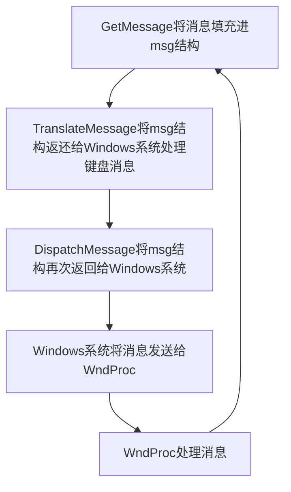
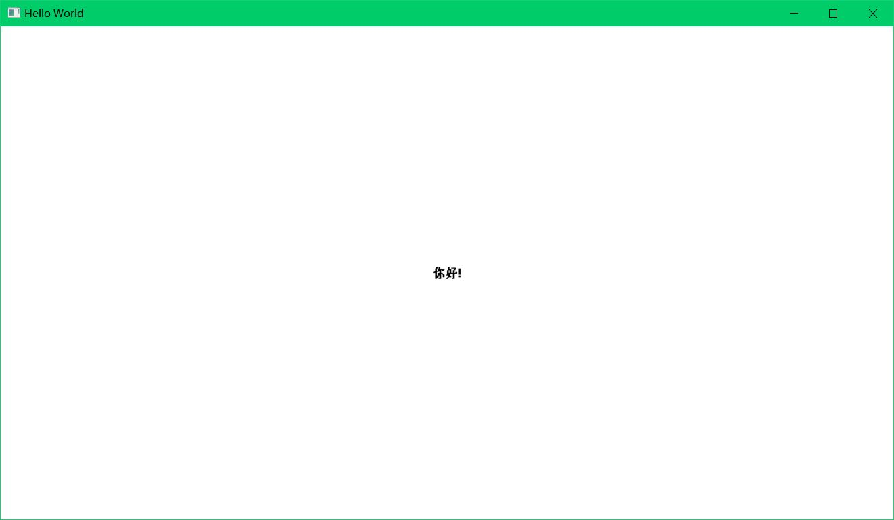

# 窗口和消息

### 创建一个窗口

每个**窗口**(window)都是一个**对象**,可以通过键盘或鼠标进行交互.用户对窗口的输入以**消息**的形式传递给窗口,窗口也通过消息与其他窗口进行通信.

当用户与窗口交互时,Windows向应用程序传递消息.应用程序创建的每一个窗口都有一个与之相关联的**窗口过程**.Windows调用该窗口过程向窗口传递消息.窗口过程依据这些消息做出相应的处理,然后将控制权返还给Windows.

窗口是根据**窗口类**创建的.窗口类标识了用于处理传递给窗口的消息的窗口过程.允许多个窗口共享同一窗口类,所以多个窗口可以使用同一窗口过程.窗口类定义了窗口的一般特征.

在OOP中,**对象**由**数据**和**代码**组成.每个窗口都是一个对象.窗口的代码对应窗口过程,窗口的数据则对应窗口过程所保留的信息以及Windows为每个窗口和存在于系统中的窗口类所保留的信息.

窗口过程用于处理传递给窗口的消息.通常,这些消息用于将用户的鼠标或键盘输入通知给窗口.如鼠标点击和拖动窗口.

当Windows程序开始执行时,Windows首先为该程序创建一个**消息队列**(message queue).它存放应用程序可能创建的所有窗口的消息.Windows程序中一般都包含一小段称为**消息循环**(message loop)的代码,用于从消息队列中检索消息,并将其分发给相应的窗口过程.其他消息则不经过消息队列直接发送给窗口过程.

### 第一个窗口程序

```c
#include<windows.h>
LRESULT CALLBACK WndProc(HWND hwnd, UINT message, WPARAM wParam, LPARAM lParam);//CALLBACK被定义为__stdcall

int __stdcall WinMain(HINSTANCE hInstance, HINSTANCE hPrevInstance, PSTR szCmdLine, int iCmdShow)
{
    static TCHAR    szAppName[] = TEXT("Hello,Windows API!");
    HWND            hWnd;
    MSG                msg;
    WNDCLASS        wndclass;

    wndclass.style = CS_HREDRAW | CS_VREDRAW;
    wndclass.lpfnWndProc = WndProc;
    wndclass.cbClsExtra = wndclass.cbWndExtra = 0;
    wndclass.hInstance = hInstance;
    wndclass.hIcon = LoadImage(NULL, IDI_APPLICATION, IMAGE_ICON, 0, 0, LR_DEFAULTSIZE);//LoadImage 加载图标以供程序使用 参阅 https://learn.microsoft.com/zh-cn/windows/win32/api/winuser/nf-winuser-loadimagea
    wndclass.hCursor = LoadImage(NULL, IDC_ARROW, IMAGE_CURSOR, 0, 0, LR_DEFAULTSIZE);
    wndclass.hbrBackground = (HBRUSH)GetStockObject(WHITE_BRUSH);//GetStockObject 获取一个图形对象 在这里用于对窗口的背景进行重绘 参阅 https://learn.microsoft.com/zh-cn/windows/win32/api/wingdi/nf-wingdi-setdcbrushcolor
    wndclass.lpszMenuName = NULL;
    wndclass.lpszClassName = szAppName;

    RegisterClass(&wndclass);//RegisterClass 注册窗口类

    hWnd = CreateWindow(
        szAppName,
        TEXT("Hello World"),
        WS_OVERLAPPEDWINDOW,
        CW_USEDEFAULT,
        CW_USEDEFAULT,
        CW_USEDEFAULT,
        CW_USEDEFAULT,
        NULL,
        NULL,
        hInstance,
        NULL
        );//CreateWindow 创建一个窗口(基于窗口类)

    ShowWindow(hWnd, iCmdShow);//ShowWindow 在屏幕中显示窗口
    UpdateWindow(hWnd);//UpdateWindow 指示窗口对其自身进行重绘

    while (GetMessage(&msg, NULL, 0, 0))//GetMessage 从消息队列获取消息
    {
        TranslateMessage(&msg);//TranslateMessage 翻译一些键盘消息
        DispatchMessage(&msg);//DispatchMessage 将消息发送给窗口过程
    }

    return msg.wParam;
}

LRESULT CALLBACK WndProc(HWND hwnd, UINT message, WPARAM wParam, LPARAM lParam)
{
    HDC hdc;
    PAINTSTRUCT ps;
    RECT rect;

    switch (message)
    {
    case WM_CREATE:
        PlaySound(TEXT("something.wav"), NULL, SND_FILENAME | SND_ASYNC);    //PlaySound 播放.wav声音文件
                                                                        //在Microsoft Visual C++中,需要在项目-属性(Alt+F7)-配置属性-链接器-输入-附加依赖项中添加winmm.lib
        return 0;
    case WM_PAINT:
        hdc = BeginPaint(hwnd, &ps);//BeginPaint 标明窗口绘制开始
        GetClientRect(hwnd, &rect);//GetClientRect 获取窗口客户区的尺寸
        DrawText(hdc, TEXT("你好!"), -1, &rect, DT_SINGLELINE | DT_CENTER | DT_VCENTER);//DrawText 显示一个文本字符串
        EndPaint(hwnd, &ps);//EndPaint 结束窗口绘制
        return 0;
    case WM_DESTROY:
        PostQuitMessage(0);//PostQuitMessage 将退出消息插入消息队列
        return 0;
    }
    return DefWindowProc(hwnd, message, wParam, lParam);//DefWindowProc 执行默认的消息处理
}

//常量标识符前缀
    //CS            类风格选项
    //CW            创建窗口选项
    //DT            文本绘制选项
    //IDI            图标的ID号
    //IDC            光标的ID号
    //MB            消息框选项
    //SND            声音选项
    //WM            窗口消息
    //WS            窗口风格

//程序中使用的数据结构
    //MSG            消息结构
    //WNDCLASS        窗口类结构
    //PAINTSTRUCT    绘制结构
    //RECT            矩形结构

//句柄
    //HINSTANCE        实例句柄(程序本身)
    //HWND            窗口句柄
    //HDC            设备环境句柄
    //HICON            图标句柄
    //HCURSOR        游标句柄
    //HBRUSH        图形画刷句柄
```

##### 注册窗口类和创建窗口

在创建应用程序窗口之前,必须调用函数`RegisterClass()`来注册窗口类.`RegisterClass()`函数的唯一一个参数是一个指向`WNDCLASS`类型的结构的指针.该结构中包含两个指向字符串的指针(字段),因此,`WNDCLASS`有窄字符和宽字符版本.

`WNDCLASS`结构的宽字符版本定义如下:

```c
typedef struct tagWNDCLASSW
{
    UINT        style;
    WNDPROC     lpfnWndProc;//前缀lpfn表示"指向函数的长指针",在Win32 API中,长指针和短指针没有区别
    int         cbClsExtra;//前缀cb代表"字节数"(count of byte),常用于表示字节尺寸的变量名称中
    int         cbWndExtra;
    HINSTANCE   hInstance;//h:句柄
    HICON       hIcon;
    HCURSOR     hCursor;
    HBRUSH      hbrBackground;//hbr:画刷的句柄(handle to a brush)
    LPCWSTR     lpszMenuName;//lpsz:指向0结尾字符串的长指针,在WNDCLASS的窄字符版本中此字段为LPCSTR
    LPCWSTR     lpszClassName;//窄字符版本为LPCSTR
}
WNDCLASSW,* PWNDCLASSW,NEAR* NPWNDCLASSW,FAR* LPWNDCLASSW;
```

在winuser.h中,根据`UNICODE`标识符是否定义,定义了`WNDCLASS`结构和指向其的指针.

下面来依次说明`WNDCLASS`结构的每个字段.

`style`

```c
wndclass.style = CS_HREDRAW | CS_VERDRAW;
```

其中,`|`是C语言中的按位或运算符.

```c
/*
 * Class styles
 */
#define CS_VREDRAW          0x0001
#define CS_HREDRAW          0x0002
#define CS_DBLCLKS          0x0008
#define CS_OWNDC            0x0020
#define CS_CLASSDC          0x0040
#define CS_PARENTDC         0x0080
#define CS_NOCLOSE          0x0200
#define CS_SAVEBITS         0x0800
#define CS_BYTEALIGNCLIENT  0x1000
#define CS_BYTEALIGNWINDOW  0x2000
#define CS_GLOBALCLASS      0x4000

#define CS_IME              0x00010000
#if(_WIN32_WINNT >= 0x0501)
#define CS_DROPSHADOW       0x00020000
#endif /* _WIN32_WINNT >= 0x0501 */
```

以上是WinUser.h中`CS_`开头的标识符.以这种方式设置的标识符被称为**位标记**(bit flag).按位或运算符用于设置相应的位.`CS_HERDRAW`和`CS_VERDRAW`指定了窗口的水平尺寸或垂直尺寸被改变时基于此窗口类的所有窗口都被重新绘制.

`lpfnWndProc`

```c
wndclass.lpfnWndProc = WndProc;
```

将窗口类的窗口过程设为`WndProc()`函数.此函数处理传递给所有基于该窗口类创建的窗口的所有消息.

`cbClsExtra`和`cbWndExtra`

```c
wndclass.cbClsExtra = wndclass.cbWndExtra = 0;
```

用于在类结构和Windows内部维护的窗口结构中预留一些额外的空间,应用程序可以根据需要使用这些额外的空间.

`hInstance`

```c
wndclass.hInstance = hInstance;
```

程序的实例句柄.

`hIcon`和`hCursor`

```c
wndclass.hIcon = LoadImage(NULL, IDI_APPLICATION, IMAGE_ICON, 0, 0, LR_DEFAULTSIZE);
wndclass.hCursor = LoadImage(NULL, IDC_ARROW, IMAGE_CURSOR, 0, 0, LR_DEFAULTSIZE);
```

设置图标和游标.

`hbrBackground`

```c
wndclass.hbrBackground = (HBRUSH)GetStockObject(WHITE_BRUSH);
```

`hbr`表示画刷的句柄.窗口客户区的背景颜色.

`lpszMenuName`

```c
wndclass.lpszMenuName = NULL;
```

指定窗口类的菜单.

`lpszClassName`

```c
wndclass.lpszClassName = szAppName;
```

窗口类的名称.可以命名为任意名称.

初始化`WNDCLASS`结构的10个字段之后,调用`RegisterClass()`注册窗口类.然后调用`CreateWindow()`创建窗口.

```c
hWnd = CreateWindow(
        szAppName,//窗口类名称,窗口通过此名称与窗口类建立关联
        TEXT("Hello World"),//窗口标题
        WS_OVERLAPPEDWINDOW,//窗口风格
        CW_USEDEFAULT,//窗口左上角初始x坐标(相对于屏幕左上角)
        CW_USEDEFAULT,//窗口左上角初始y坐标(相对于屏幕左上角)
        CW_USEDEFAULT,//窗口的初始x大小(宽度)
        CW_USEDEFAULT,//窗口的初始y大小(高度)
        NULL,//父窗口句柄
        NULL,//窗口菜单句柄
        hInstance,//程序实例句柄
        NULL//创建参数
        );//CreateWindow 创建一个窗口(基于窗口类)
```

此时,Windows已经分配了一块内存来保存`CreateWindow()`函数调用中指定的窗口信息以及一些其他信息.Windows可通过窗口句柄来获取这些信息.

接下来,需要调用`ShowWindow()`函数将窗口显示在屏幕中.该函数的第一个参数是指向刚才`CreateWindow()`函数创建的窗口的句柄`hWnd`.第二个参数是`WinMain()`函数所接收的`iCmdShow`值.

| 窗口显示情况 | iCmdShow的值           |
| ------ | -------------------- |
| 最大化    | `SW_SHOWMAXIMAZED`   |
| 正常显示   | `SW_SHOWNORMAL`      |
| 最小化    | `SW_SHOWMINNOACTIVE` |

如果`ShowWindow()`函数的第二个参数是`SW_SHOWNORMAL`,则该窗口的客户区将被在窗口类中指定的画刷擦除,在此例中是`WHITE_BRUSH`.然后`UpdateWindow(hWnd)`调用向窗口过程(此例中为`WndProc()`)发送一条`WM_PAINT`消息使客户区重绘.

##### 消息循环和消息处理

调用`UpdateWindow()`后,窗口便在屏幕中完全可见了.但是,程序需要能够接收键盘和鼠标输入.每一个Windows应用程序都有一个由Windows维护的消息队列.输入事件发生后,Windows自动将事件转换为消息,并将其放在消息队列中.

应用程序通过执行一段叫作**消息循环**的代码段从该消息队列中获取消息:

```c
while(GetMessage(&msg,NULL,0,0))
{
    TranslateMessage(&msg);
    DispatchMessage(&msg);
}
```

其中`msg`的类型是`MSG`.下面是`MSG`结构的定义(在WinUser.h中):

```c
/*
 * Message structure
 */
typedef struct tagMSG {
    HWND        hwnd;//消息所指向的窗口的句柄
    UINT        message;//消息标识符(一个用于标识消息的数字,对于每条消息都定义了以WM_开头的标识符)
    WPARAM      wParam;//32位的消息参数,含义取决于具体的消息
    LPARAM      lParam;//同上
    DWORD       time;//消息进入消息队列的时间
    POINT       pt;//消息进入消息队列中时鼠标指针的位置坐标
#ifdef _MAC
    DWORD       lPrivate;
#endif
} MSG, *PMSG, NEAR *NPMSG, FAR *LPMSG;
```

`MSG`结构中`POINT`结构的定义如下(在windef.h中):

```c
typedef struct tagPOINT
{
    LONG  x;
    LONG  y;
} POINT, *PPOINT, NEAR *NPPOINT, FAR *LPPOINT;
```

`GetMessage()`函数用于从消息队列中检索消息:

```c
GetMessage(&msg,NULL,0,0);
```

第1个参数是一个指向`MSG`结构的指针,第2,3,4个参数表明该程序希望获取由该程序所创建的所有窗口的消息.消息队列中的下一条消息将被填充到消息结构的各个字段中.

如果`GetMessage()`从消息队列中检索到的消息等于`WM_QUIT`,返回0,否则返回非0值.

`TranslateMessage(&msg);`将msg结构返还给Windows进行某些键盘消息转换.

`DispatchMessage(&msg);`分发消息到对应窗口.

然后,Windows调用合适的窗口过程(此例中为`WndProc()`),将这条消息发送给其处理.



窗口过程总是定义为如下形式:

```c
LRASULT CALLBACK WndProc(HWND hwnd,UINT message,WPARAM wParam,LPARAM lParam)
```

窗口过程的4个参数与`MSG`结构的前4个字段一一对应.

窗口过程总是由Windows自身调用.应用程序如果想要调用自身的窗口过程,则可使用函数`SendMessage()`.

通常在窗口过程中使用switch-case结构确定窗口过程收到的消息类型和相应的处理方法.winuser.h中为各种类型的消息定义了以`WM_`为前缀的标识符.当窗口过程对消息进行处理后,应返回0.窗口过程不处理的消息都必须传给`DefWindowProc()`.此函数的返回值必须从窗口过程返回.

---

大多数Windows程序的主要任务是处理各种各样的消息.这些消息通常都带有前缀`WM_`,定义大多数都在winuser.h中.这些消息产生后,被转给窗口过程,然后由窗口过程进行处理.

---

**WM_CREATE**

```c
case WM_CREATE:
        PlaySound(TEXT("something.wav"), NULL, SND_FILENAME | SND_ASYNC);    //PlaySound 播放.wav声音文件
                                                                        //在Microsoft Visual C++中,需要在项目-属性(Alt+F7)-配置属性-链接器-输入-附加依赖项中添加winmm.lib
        return 0;
```

`WM_CREATE`消息是一个窗口过程接收到的第一条消息.当`WinMain()`调用`CreateWindow()`时,Windows完成其必须的操作,在此过程中Windows对`WndProc()`进行调用,并将其第一个参数设为该窗口的句柄,将第二个参数设为`WM_CREATE`.然后`WndProc()`对`WM_CREATE`消息进行处理,并将控制权返还给Windows.再然后Windows从`CreateWindow()`调用返回到`WinMain()`中.


以下是**Windows调用WndProc**的情况:

| 序号  | 情况        |
|:---:|:---------:|
| 1   | 新建窗口      |
| 2   | 窗口尺寸发生变化  |
| 3   | 窗口被最小化    |
| 4   | 窗口被移动     |
| 5   | 鼠标单击      |
| 6   | 鼠标双击      |
| 7   | 滚动条       |
| 8   | 选择菜单项     |
| 9   | 键盘输入      |
| 10  | 窗口客户区需要重绘 |
| 11  | 窗口被最终销毁   |
| 12  | ...       |

此程序中,通过调用`PlaySound()`函数播放一个.wav(波形声音)文件作为对该消息的处理.`PlaySound()`函数的第一个参数是波形文件的名称,也可以是控制面板的声音控制区定义的声音别名或应用程序资源.第二个参数只有当声音文件是一个资源时才有用.第三个参数指定了一组选项.该程序中第一个参数为文件名且该段声音是以异步方式播放的(当指定的声音文件开始播放时`PlaySound()`函数立即返回,无需等待该文件播放结束).

**WM_PAINT**

```c
case WM_PAINT:
        hdc = BeginPaint(hwnd, &ps);//BeginPaint 标明窗口绘制开始
        GetClientRect(hwnd, &rect);//GetClientRect 获取窗口客户区的尺寸
        DrawText(hdc, TEXT("你好!"), -1, &rect, DT_SINGLELINE | DT_CENTER | DT_VCENTER);//DrawText 显示一个文本字符串
        EndPaint(hwnd, &ps);//EndPaint 结束窗口绘制
        return 0;
```

`WM_PAINT`是窗口过程处理的第二条消息.当窗口的客户区部分或全部**无效**且必须**更新**时,窗口过程将收到此消息.

窗口的客户区无效的情况:

> 窗口被首次创建时(此时程序尚未在窗口上绘制任何东西)
> 
> 调整窗口尺寸时且`wndclass`的`style`字段设置了`CS_HERDRAW`和`CS_VERDRAW`
> 
> 窗口从最小化恢复之后
> 
> 窗口被部分或全部覆盖后,被覆盖的区域不再被遮挡时

对`WM_PAINT`消息的处理几乎总是从调用`BeginPaint()`开始,以调用`EndPaint()`结束.这两个函数调用中第一个参数都是程序的窗口句柄(`hWnd`),第二个参数都是指向`PAINTSTRUCT`类型的结构的指针.

在`BeginPaint()`调用期间,如果客户区的背景尚未被擦除,则Windows会使用用于注册窗口类的`WNDCLASS`结构中的`hbrBackground`字段指定的画刷对其进行擦除.`BeginPaint()`使整个客户区有效,并返回一个设备环境句柄.设备环境指物理输出设备及其设备驱动程序.`EndPaint()`释放设备环境句柄,以使其无效.

`GetClientRect()`的第一个参数是程序的窗口的句柄,第二个参数是一个指针,指向一个`RECT`结构.

```c
typedef struct tagRECT
{
    LONG    left;
    LONG    top;
    LONG    right;
    LONG    bottom;
} RECT, *PRECT, NEAR *NPRECT, FAR *LPRECT;
```

其中`left`和`top`字段总会被`GetClient()`设置为0,`right`和`bottom`字段会分别被设置为客户区的宽度和高度(px).

`DrawText()`函数:

```c
DrawText(
    hdc,//BeginPaint()返回的设备环境句柄
    TEXT("你好!"),//要绘制的文本
    -1,//表示字符串以0结尾
    &rect,//经GetClientRect()修改过的RECT类型的结构
    DT_SINGLELINE | DT_CENTER | DT_VCENTER//在上一个参数限定的矩形范围内单行显示,水平和垂直居中
    );
```

**WM_DESTROY**

当用户从程序的系统菜单里选择了“关闭”或者点击了窗口右上角的×，窗口过程就会收到`WM_CLOSE`.`DefWindowProc()`对 `WM_CLOSE`的处理是调用`DestroyWindow()`.`DestroyWindow()`完成窗口的清理工作，然后向窗口过程发送`WM_DESTROY`.`DefWindowProc()`不会处理`WM_DESTROY`消息.`WM_DESTROY`消息如果不处理,窗口销毁后进程并不会结束.处理 `WM_DESTROY`时一般先释放资源,然后调用`PostQuitMessage()`.`PostQuitMessage()`会发送`WM_QUIT`给消息队列.`GetMessage()`得到`WM_QUIT`后就会返回`FALSE`,从而结束消息循环.

`PostQuitMessage()`传入的参数将作为`WM_QUIT`消息的`wParam`参数送到消息队列.

在`WinMain()`中:

```c
while (GetMessage(&msg, NULL, 0, 0))//GetMessage 从消息队列获取消息
    {
        TranslateMessage(&msg);//TranslateMessage 翻译一些键盘消息
        DispatchMessage(&msg);//DispatchMessage 将消息发送给窗口过程
    }

    return msg.wParam;
```

所以程序将返回0.

在Micorsoft Visual C++中,按F5调试程序:



##### 队列消息和非队列消息

**队列消息**是指由Windows直接放入程序的消息队列中的消息.队列消息主要由用户输入产生,如:

| 标识符              | 消息    |
| ---------------- | ----- |
| WM_KEY...        | 按键消息  |
| WM_CHAR          | 字符消息  |
| WM_MOUSEMOVE     | 鼠标移动  |
| WM_L/RBUTTONDOWN | 鼠标单击  |
| WM_TIMER         | 定时器消息 |
| WM_PAINT         | 重绘消息  |
| WM_QUIT          | 退出消息  |

**非队列消息**则是Windows对窗口过程的直接调用产生的.其通常由调用特定的Windows函数引起.如:

```c
hWnd = CreateWindow(/*参数*/);//WM_CREATE
ShowWindow(hWnd, iCmdShow);//WM_SIZE,WM_SHOWWINDOW
UpdateWindow(hWnd);//WM_PAINT
```

队列消息也能产生非队列消息.如:用键盘或鼠标选择某个菜单项时,键盘或鼠标消息进入消息队列,但是表明某个菜单项被选中的`WM_COMMAND`消息却是一个非队列消息.

有一点需要注意:窗口过程可以调用为其发送消息的函数.如果你在窗口过程中对某个静态变量或全局变量进行了设置,然后调用了一个Windows函数,这个函数也许会产生另外一条消息,然后再次调用窗口过程,这个静态变量或全局变量则可能被修改.在处理完第二条消息后,窗口过程接着处理第一条消息.此时,该静态变量或全局变量的值可能不是你想要的.

2024.8.5
